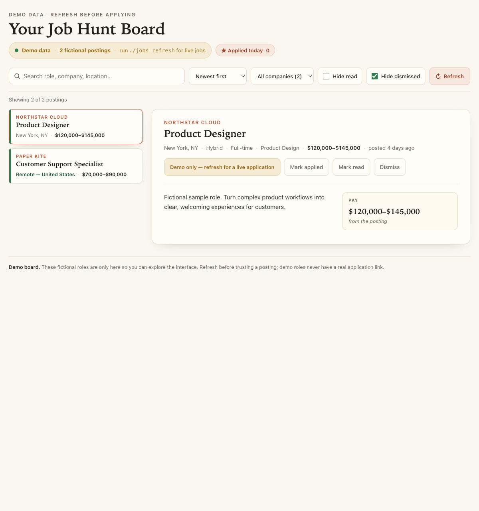
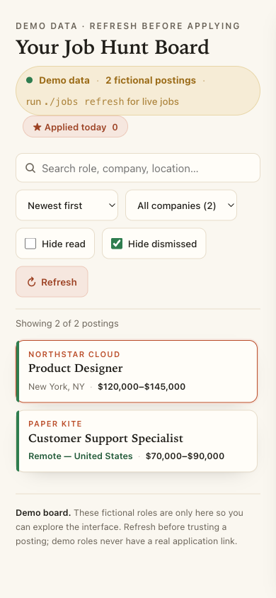

# Job Hunt Board

A small, local-first job-hunt workspace that collects real openings for any
kind of role from official company applicant-tracking systems (ATS). Search
and filter in one calm board, open the exact application, and keep your triage
on your own Mac.

The product is called `job-board` and is intentionally not limited to one
field: start with the public title list empty to see every kind of job, or add
the titles and keywords you want. The current public GitHub URL is still
`github.com/nlau1193/finance-job-board` while the repository owner completes
the requested rename; use the **Code** menu on that page for the clone command.

## The easiest setup

Open this folder in Codex and ask:

> Set up this job board and start it for me.

Codex can run the same commands shown below and diagnose anything that does not
work. Codex is only a convenient installer; the board itself does not use AI.
It has no account, API key, paid service, or subscription.

## Install it yourself

You need macOS and Python 3.10 or newer.

On GitHub, choose **Code → Download ZIP**, unzip it, then open Terminal in the
unpacked project folder. If you already use Git, copy the HTTPS clone command
shown in that same **Code** menu. Then run:

```bash
./jobs setup
./jobs configure --interactive
./jobs start
```

`./jobs setup` creates an isolated environment inside the project.
`./jobs configure --interactive` asks which titles and locations you want. Type
`all` for titles if you want every kind of role, or for locations if geography
should not filter the board.
`./jobs start` opens the private local board. Leave its small Terminal window
running and use the board’s **Refresh** button whenever you want current jobs.

Refresh reads only official Greenhouse, Ashby, Lever, and Workday feeds. It
re-reads your private preferences, filters the fresh postings, preserves read
and dismissed state, and keeps the last good board if the network is down or
too many company feeds fail. There is no crawler, browser robot, model, or paid
fallback.

For a very large all-role board, the browser receives short description and
application previews so search stays responsive. The complete ATS data remains
in your local `data/jobs.local.json`, and **Apply** still opens the official
posting for the full details.

If setup does not finish, run:

```bash
./jobs doctor
```

The doctor prints the failed check and the next command to try.

## Working proof

These screenshots are from the committed fictional starter board, so they are
safe to share and do not contain a person's resume, connections, or live
application data. On a real install, run `./jobs start` and use **Refresh** to
replace the demo with the roles and locations in your private search file.





## Make it yours

- Run `./jobs configure --interactive` for the common choices.
- Edit `config/search.local.json` for every search and fit setting, including an
  optional company shortlist. This private file is created from
  `config/search.example.json` and ignored by Git.
- Leave `title_keywords` empty to include every kind of job; use
  `title_exclude` for titles you never want to see.
- If you edit the JSON by hand, keep titles, locations, and exclusions as lists
  (for example `["backend", "iOS"]`) and keep `remote_ok` as `true` or
  `false`. `./jobs doctor` catches a malformed value before it can hide the
  wrong jobs.
- Locations are independent of job type. The starter suggests New York and
  remote US roles, but you can replace those with any cities, regions, or a
  remote preference.
- Contributors can extend the public official-company universe in
  `config/companies.json`.
- Export LinkedIn Connections as CSV and save it as `data/connections.csv` to
  show people you already know at each company. This is optional.

Personal preferences, board state, and connections are ignored by Git. The
committed demo data is fictional. To hand someone your exact setup, copy only
`config/search.local.json`; add `data/connections.csv` only if they explicitly
want that private information too.

## Privacy

The core refresh and board are local. They call official public ATS endpoints
and write the resulting board to `data/jobs.local.json`.

There is no LinkedIn automation. If you add your own official Connections CSV,
matching happens locally. Ordinary LinkedIn search links open only when you
choose them. The tool never logs in, scrapes, messages, or submits an
application.

## Contributor setup

```bash
./jobs setup
./.venv/bin/python -m pip install -r requirements-dev.txt
./.venv/bin/python -m pytest --cov=jobhunt --cov=jobs --cov-report=term-missing --cov-fail-under=60 -q
npm ci
npx playwright install chromium
npm run test:e2e
```

The Python gate checks the pipeline (`discover → filter → enrich → store → render`)
with a 60% coverage floor. The Playwright gate boots an isolated fictional board
and checks the desktop, phone, refresh, keyboard, and local API paths without
calling a live ATS. See `CONTRIBUTING.md` for the release floor and project map.

## Security

Do not commit `config/search.local.json`, `data/jobs.local.json`,
`data/connections.csv`, or generated boards. Report a vulnerability using
`SECURITY.md`.

## License

MIT. See `LICENSE`.
